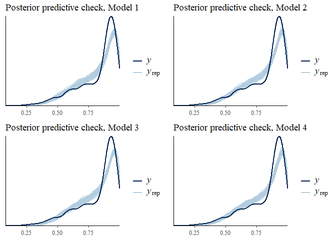

``` r
for(level in levels(total$kaiscore)){
  a <- ggplot(total[total$kaiscore == level,], aes(AllAiScores, AllScores, group = AllAiScores)) +
    geom_point()+   
    stat_summary(fun.y = mean, colour="blue", geom="line", aes(group=1))+
    geom_point(total[total$kaiscore == level,],mapping= aes(AllAiScores,mean_score, color = "red"))+
    geom_errorbar(aes(ymin=mean_score-sd_score, ymax=mean_score+sd_score), width=.2,
                 position=position_dodge(0.05),color="red", alpha = .5)+
    ggtitle(paste("mean Kaiscore = ", as.character(level), sep = " "))+
    xlab("KaiRange")+ylab("Car Design Performance")
  
  print(a)
}
```

``` r
total$kaiscore <- as.numeric(as.character(total$kaiscore))
total$scaled_scores <- scale(total$AllScores)
total$kaiscore_scale <- scale(total$kaiscore)
total$aiRange_scale <- scale(total$aiRange)
total$mean_kaiscore_scale <- scale(total$mean_kaiscore)
total$max_kaiscore_scale <- scale(total$max_kaiscore)
total$min_kaiscore_scale <- scale(total$min_kaiscore)
total$true_range_scale <- scale(total$true_range)

#function for performing min max normalization
normalize <- function(x)
{
    return((x- min(x)) /(max(x)-min(x)))
}

#normalizing scores
total$normalized_scores <- normalize(total$AllScores)

#Couldn't get conceptual min and max scores so using min and max scores obtained
total_2 <- total %>% filter(normalized_scores != 0 & normalized_scores != 1)
```

Min-max models

Mean model without interaction

``` r
#specifying model predicting score from mean KAI score and KAi score range of team
model_beta <- bf(
  normalized_scores  ~ 1 + mean_kaiscore_scale + true_range_scale, family = "beta"
)

#Defining priors
get_prior(model_beta, data = total_2)
```

    ##                 prior     class                coef group resp dpar nlpar
    ## 1                             b                                          
    ## 2                             b mean_kaiscore_scale                      
    ## 3                             b    true_range_scale                      
    ## 4 student_t(3, 0, 10) Intercept                                          
    ## 5   gamma(0.01, 0.01)       phi                                          
    ##   bound
    ## 1      
    ## 2      
    ## 3      
    ## 4      
    ## 5

``` r
priors_beta <- c(
  prior(normal(0, 1.5), class =Intercept),
  prior(normal(0,.5), class = b),
  prior(normal(30,10), class = phi)
)

#mean model priors
mean_beta_0_prior <- brm(
  model_beta, 
  prior = priors_beta,
  data = total_2,
  cores = 4,
  sample_prior = "only",
  control = list(adapt_delta = 0.999)
)
```

    ## Compiling the C++ model

    ## Start sampling

``` r
#prior predictive check
(m_b_0_pri <- pp_check(mean_beta_0_prior, nsamples = 100) +
    ggtitle("Prior predictive check, Model 1"))
```


``` r
#inspecting chains
mcmc_trace(mean_beta_0_prior)
```


``` r
#mean model posteriors
mean_beta_0_posterior <- brm(
  model_beta, 
  prior = priors_beta,
  data = total_2,
  cores = 4,
  sample_prior = T,
  control = list(adapt_delta = 0.999)
)
```

    ## Compiling the C++ model
    ## Start sampling

``` r
#posterior predictive check
(m_b_0_pos <- pp_check(mean_beta_0_posterior, nsamples = 100) +
    ggtitle("Posterior predictive check, Model 1"))
```


``` r
#inspecting chains
trace_m_b_0 <- mcmc_trace(mean_beta_0_posterior, pars = c("b_Intercept", "b_mean_kaiscore_scale", "b_true_range_scale")) + ggtitle("Markov Chain Monte Carlo trace plots, Model 1")

#model summary
summary(mean_beta_0_posterior)
```

    ##  Family: beta 
    ##   Links: mu = logit; phi = identity 
    ## Formula: normalized_scores ~ 1 + mean_kaiscore_scale + true_range_scale 
    ##    Data: total_2 (Number of observations: 1950) 
    ## Samples: 4 chains, each with iter = 2000; warmup = 1000; thin = 1;
    ##          total post-warmup samples = 4000
    ## 
    ## Population-Level Effects: 
    ##                     Estimate Est.Error l-95% CI u-95% CI Rhat Bulk_ESS
    ## Intercept               1.81      0.02     1.78     1.84 1.00     1821
    ## mean_kaiscore_scale     0.92      0.02     0.89     0.95 1.00     2274
    ## true_range_scale        0.25      0.01     0.22     0.27 1.00     2493
    ##                     Tail_ESS
    ## Intercept               2258
    ## mean_kaiscore_scale     2441
    ## true_range_scale        1930
    ## 
    ## Family Specific Parameters: 
    ##     Estimate Est.Error l-95% CI u-95% CI Rhat Bulk_ESS Tail_ESS
    ## phi    20.06      0.66    18.77    21.36 1.00     2451     2523
    ## 
    ## Samples were drawn using sampling(NUTS). For each parameter, Bulk_ESS
    ## and Tail_ESS are effective sample size measures, and Rhat is the potential
    ## scale reduction factor on split chains (at convergence, Rhat = 1).

``` r
#hypothesis testing
hypothesis(mean_beta_0_posterior, c("true_range_scale > 0",
                  "mean_kaiscore_scale > 0"))
```

    ## Hypothesis Tests for class b:
    ##                 Hypothesis Estimate Est.Error CI.Lower CI.Upper Evid.Ratio
    ## 1   (true_range_scale) > 0     0.25      0.01     0.23     0.27        Inf
    ## 2 (mean_kaiscore_sc... > 0     0.92      0.02     0.90     0.95        Inf
    ##   Post.Prob Star
    ## 1         1    *
    ## 2         1    *
    ## ---
    ## 'CI': 90%-CI for one-sided and 95%-CI for two-sided hypotheses.
    ## '*': For one-sided hypotheses, the posterior probability exceeds 95%;
    ## for two-sided hypotheses, the value tested against lies outside the 95%-CI.
    ## Posterior probabilities of point hypotheses assume equal prior probabilities.

``` r
#plotting model effects
conditional_effects(mean_beta_0_posterior)
```


``` r
#adding IC criteria
mean_beta_0_posterior <- add_criterion(mean_beta_0_posterior, "loo", reloo = T)
```

    ## No problematic observations found. Returning the original 'loo' object.

``` r
mean_beta_0_posterior <- add_criterion(mean_beta_0_posterior, "waic")
```

Mean model with interaction

``` r
#updating formula to include interaction and computing priors
mean_beta_1_prior <- update(mean_beta_0_prior, 
                            bf(normalized_scores  ~ 1 + mean_kaiscore_scale + true_range_scale +
                                 mean_kaiscore_scale:true_range_scale, family = "beta"))
```

    ## Start sampling

    ## 
    ## SAMPLING FOR MODEL 'cdb24686134243eab21b7c6eb8d457dc' NOW (CHAIN 1).
    ## Chain 1: 
    ## Chain 1: Gradient evaluation took 0 seconds
    ## Chain 1: 1000 transitions using 10 leapfrog steps per transition would take 0 seconds.
    ## Chain 1: Adjust your expectations accordingly!
    ## Chain 1: 
    ## Chain 1: 
    ## Chain 1: Iteration:    1 / 2000 [  0%]  (Warmup)
    ## Chain 1: Iteration:  200 / 2000 [ 10%]  (Warmup)
    ## Chain 1: Iteration:  400 / 2000 [ 20%]  (Warmup)
    ## Chain 1: Iteration:  600 / 2000 [ 30%]  (Warmup)
    ## Chain 1: Iteration:  800 / 2000 [ 40%]  (Warmup)
    ## Chain 1: Iteration: 1000 / 2000 [ 50%]  (Warmup)
    ## Chain 1: Iteration: 1001 / 2000 [ 50%]  (Sampling)
    ## Chain 1: Iteration: 1200 / 2000 [ 60%]  (Sampling)
    ## Chain 1: Iteration: 1400 / 2000 [ 70%]  (Sampling)
    ## Chain 1: Iteration: 1600 / 2000 [ 80%]  (Sampling)
    ## Chain 1: Iteration: 1800 / 2000 [ 90%]  (Sampling)
    ## Chain 1: Iteration: 2000 / 2000 [100%]  (Sampling)
    ## Chain 1: 
    ## Chain 1:  Elapsed Time: 5.491 seconds (Warm-up)
    ## Chain 1:                6.401 seconds (Sampling)
    ## Chain 1:                11.892 seconds (Total)
    ## Chain 1: 
    ## 
    ## SAMPLING FOR MODEL 'cdb24686134243eab21b7c6eb8d457dc' NOW (CHAIN 2).
    ## Chain 2: 
    ## Chain 2: Gradient evaluation took 0 seconds
    ## Chain 2: 1000 transitions using 10 leapfrog steps per transition would take 0 seconds.
    ## Chain 2: Adjust your expectations accordingly!
    ## Chain 2: 
    ## Chain 2: 
    ## Chain 2: Iteration:    1 / 2000 [  0%]  (Warmup)
    ## Chain 2: Iteration:  200 / 2000 [ 10%]  (Warmup)
    ## Chain 2: Iteration:  400 / 2000 [ 20%]  (Warmup)
    ## Chain 2: Iteration:  600 / 2000 [ 30%]  (Warmup)
    ## Chain 2: Iteration:  800 / 2000 [ 40%]  (Warmup)
    ## Chain 2: Iteration: 1000 / 2000 [ 50%]  (Warmup)
    ## Chain 2: Iteration: 1001 / 2000 [ 50%]  (Sampling)
    ## Chain 2: Iteration: 1200 / 2000 [ 60%]  (Sampling)
    ## Chain 2: Iteration: 1400 / 2000 [ 70%]  (Sampling)
    ## Chain 2: Iteration: 1600 / 2000 [ 80%]  (Sampling)
    ## Chain 2: Iteration: 1800 / 2000 [ 90%]  (Sampling)
    ## Chain 2: Iteration: 2000 / 2000 [100%]  (Sampling)
    ## Chain 2: 
    ## Chain 2:  Elapsed Time: 4.932 seconds (Warm-up)
    ## Chain 2:                2.903 seconds (Sampling)
    ## Chain 2:                7.835 seconds (Total)
    ## Chain 2: 
    ## 
    ## SAMPLING FOR MODEL 'cdb24686134243eab21b7c6eb8d457dc' NOW (CHAIN 3).
    ## Chain 3: 
    ## Chain 3: Gradient evaluation took 0 seconds
    ## Chain 3: 1000 transitions using 10 leapfrog steps per transition would take 0 seconds.
    ## Chain 3: Adjust your expectations accordingly!
    ## Chain 3: 
    ## Chain 3: 
    ## Chain 3: Iteration:    1 / 2000 [  0%]  (Warmup)
    ## Chain 3: Iteration:  200 / 2000 [ 10%]  (Warmup)
    ## Chain 3: Iteration:  400 / 2000 [ 20%]  (Warmup)
    ## Chain 3: Iteration:  600 / 2000 [ 30%]  (Warmup)
    ## Chain 3: Iteration:  800 / 2000 [ 40%]  (Warmup)
    ## Chain 3: Iteration: 1000 / 2000 [ 50%]  (Warmup)
    ## Chain 3: Iteration: 1001 / 2000 [ 50%]  (Sampling)
    ## Chain 3: Iteration: 1200 / 2000 [ 60%]  (Sampling)
    ## Chain 3: Iteration: 1400 / 2000 [ 70%]  (Sampling)
    ## Chain 3: Iteration: 1600 / 2000 [ 80%]  (Sampling)
    ## Chain 3: Iteration: 1800 / 2000 [ 90%]  (Sampling)
    ## Chain 3: Iteration: 2000 / 2000 [100%]  (Sampling)
    ## Chain 3: 
    ## Chain 3:  Elapsed Time: 5.024 seconds (Warm-up)
    ## Chain 3:                2.796 seconds (Sampling)
    ## Chain 3:                7.82 seconds (Total)
    ## Chain 3: 
    ## 
    ## SAMPLING FOR MODEL 'cdb24686134243eab21b7c6eb8d457dc' NOW (CHAIN 4).
    ## Chain 4: 
    ## Chain 4: Gradient evaluation took 0 seconds
    ## Chain 4: 1000 transitions using 10 leapfrog steps per transition would take 0 seconds.
    ## Chain 4: Adjust your expectations accordingly!
    ## Chain 4: 
    ## Chain 4: 
    ## Chain 4: Iteration:    1 / 2000 [  0%]  (Warmup)
    ## Chain 4: Iteration:  200 / 2000 [ 10%]  (Warmup)
    ## Chain 4: Iteration:  400 / 2000 [ 20%]  (Warmup)
    ## Chain 4: Iteration:  600 / 2000 [ 30%]  (Warmup)
    ## Chain 4: Iteration:  800 / 2000 [ 40%]  (Warmup)
    ## Chain 4: Iteration: 1000 / 2000 [ 50%]  (Warmup)
    ## Chain 4: Iteration: 1001 / 2000 [ 50%]  (Sampling)
    ## Chain 4: Iteration: 1200 / 2000 [ 60%]  (Sampling)
    ## Chain 4: Iteration: 1400 / 2000 [ 70%]  (Sampling)
    ## Chain 4: Iteration: 1600 / 2000 [ 80%]  (Sampling)
    ## Chain 4: Iteration: 1800 / 2000 [ 90%]  (Sampling)
    ## Chain 4: Iteration: 2000 / 2000 [100%]  (Sampling)
    ## Chain 4: 
    ## Chain 4:  Elapsed Time: 3.637 seconds (Warm-up)
    ## Chain 4:                3.776 seconds (Sampling)
    ## Chain 4:                7.413 seconds (Total)
    ## Chain 4:

``` r
#prior predictive check
(m_b_1_pri <- pp_check(mean_beta_1_prior, nsamples = 100) + 
    ggtitle("Prior predictive check, Model 2"))
```


``` r
#inspecting chains
mcmc_trace(mean_beta_1_prior)
```


``` r
#updating formula to include interaction and computing posteriors
# mean_beta_1_posterior <- update(mean_beta_0_posterior, 
#                             bf(normalized_scores  ~ 1 + mean_kaiscore_scale + true_range_scale +
#                                  mean_kaiscore_scale:true_range_scale, family = "beta"))

mean_beta_1_posterior <- brm(
  bf(normalized_scores  ~ 1 + mean_kaiscore_scale + true_range_scale +
                                 mean_kaiscore_scale:true_range_scale, family = "beta"), 
  prior = priors_beta,
  data = total_2,
  cores = 4,
  sample_prior = T,
  control = list(adapt_delta = 0.999)
)
```

    ## Compiling the C++ model

    ## recompiling to avoid crashing R session

    ## Start sampling

``` r
#posterior predictive check
(m_b_1_pos <- pp_check(mean_beta_1_posterior, nsamples = 100) + 
    ggtitle("Posterior predictive check, Model 2"))
```


``` r
#inspecting chains
trace_m_b_1 <- mcmc_trace(mean_beta_1_posterior, pars = c("b_Intercept", "b_mean_kaiscore_scale",
                                                          "b_true_range_scale",
                                                          "b_mean_kaiscore_scale:true_range_scale")) +
  ggtitle("Markov Chain Monte Carlo trace plots, Model 2")

#model summary
summary(mean_beta_1_posterior)
```

    ##  Family: beta 
    ##   Links: mu = logit; phi = identity 
    ## Formula: normalized_scores ~ 1 + mean_kaiscore_scale + true_range_scale + mean_kaiscore_scale:true_range_scale 
    ##    Data: total_2 (Number of observations: 1950) 
    ## Samples: 4 chains, each with iter = 2000; warmup = 1000; thin = 1;
    ##          total post-warmup samples = 4000
    ## 
    ## Population-Level Effects: 
    ##                                      Estimate Est.Error l-95% CI u-95% CI
    ## Intercept                                1.81      0.02     1.78     1.84
    ## mean_kaiscore_scale                      0.91      0.02     0.87     0.94
    ## true_range_scale                         0.24      0.01     0.21     0.26
    ## mean_kaiscore_scale:true_range_scale    -0.04      0.02    -0.08    -0.00
    ##                                      Rhat Bulk_ESS Tail_ESS
    ## Intercept                            1.00     2587     2695
    ## mean_kaiscore_scale                  1.00     2322     2584
    ## true_range_scale                     1.00     2814     2828
    ## mean_kaiscore_scale:true_range_scale 1.00     2308     2390
    ## 
    ## Family Specific Parameters: 
    ##     Estimate Est.Error l-95% CI u-95% CI Rhat Bulk_ESS Tail_ESS
    ## phi    20.06      0.64    18.82    21.37 1.00     2632     2732
    ## 
    ## Samples were drawn using sampling(NUTS). For each parameter, Bulk_ESS
    ## and Tail_ESS are effective sample size measures, and Rhat is the potential
    ## scale reduction factor on split chains (at convergence, Rhat = 1).

``` r
#hypothesis testing
hypothesis(mean_beta_1_posterior, c("true_range_scale > 0",
                  "mean_kaiscore_scale > 0",
                  "mean_kaiscore_scale:true_range_scale < 0"))
```

    ## Hypothesis Tests for class b:
    ##                 Hypothesis Estimate Est.Error CI.Lower CI.Upper Evid.Ratio
    ## 1   (true_range_scale) > 0     0.24      0.01     0.21     0.26        Inf
    ## 2 (mean_kaiscore_sc... > 0     0.91      0.02     0.88     0.94        Inf
    ## 3 (mean_kaiscore_sc... < 0    -0.04      0.02    -0.07    -0.01      54.56
    ##   Post.Prob Star
    ## 1      1.00    *
    ## 2      1.00    *
    ## 3      0.98    *
    ## ---
    ## 'CI': 90%-CI for one-sided and 95%-CI for two-sided hypotheses.
    ## '*': For one-sided hypotheses, the posterior probability exceeds 95%;
    ## for two-sided hypotheses, the value tested against lies outside the 95%-CI.
    ## Posterior probabilities of point hypotheses assume equal prior probabilities.

``` r
#plotting model effects
conditional_effects(mean_beta_1_posterior)
```


Plotting for mean models

``` r
#average predictions from mean models
avg_dat_int <- tibble()
for (i in c(-1:1)){ #looping with pp average to generate predictions for different values of range
  nd <- tibble(mean_kaiscore_scale = seq(-1,1, length.out = 200),
               true_range_scale = i)
  pp_avg <- pp_average(mean_beta_0_posterior, mean_beta_1_posterior,
             method = "fitted",
             newdata = nd) %>% 
    as_tibble() %>% 
    bind_cols(nd)
  avg_dat_int <- bind_rows(avg_dat_int, pp_avg)
}
  
avg_dat_int$true_range_scale <- as.factor(avg_dat_int$true_range_scale)  #as factor for grouping

#plotting data
avg_dat_int %>% 
  ggplot(aes(x = mean_kaiscore_scale, y = Estimate, fill = true_range_scale,
             color = true_range_scale))+
  geom_smooth(aes(y = Estimate, ymin = Q2.5, ymax = Q97.5), stat = "identity")+
  labs(y = "Normalized Scores", x = "Scaled mean team KAI score", 
       color = "Scaled KAI range of team", fill = "Scaled KAI range of team")+
  theme_bw()+
  ggtitle("Average effect of interaction of model 1 & 2")
```


``` r
#generating predictions for the effect of range excluding the interaction
nd <- tibble(mean_kaiscore_scale = -1, #keep mean kai constant
               true_range_scale = seq(-1,1, length.out = 200))
pp_avg <- pp_average(mean_beta_0_posterior, mean_beta_1_posterior,
             method = "fitted",
             newdata = nd) %>% 
    as_tibble() %>% 
    bind_cols(nd)

#plotting data
pp_avg %>% 
  ggplot(aes(x = true_range_scale, y = Estimate))+
  geom_smooth(aes(y = Estimate, ymin = Q2.5, ymax = Q97.5), stat = "identity")+
  labs(y = "Normalized Scores", x = "Scaled KAI range of team")+
  theme_bw()+
  ggtitle("Average effects of KAI score range in model 1 & 2", "Scaled team KAI score = -1")
```


``` r
#plotting hypotheses mean model without interaction
gridExtra::grid.arrange(
  plot(hypothesis(mean_beta_0_posterior, "true_range_scale > 0"))[[1]]+ 
      ggtitle("Effect of KAI range on performance", "4.a"),
  plot(hypothesis(mean_beta_0_posterior, "mean_kaiscore_scale > 0"))[[1]]+ 
      ggtitle("Effect of KAI score on performance", "4.b"), nrow = 2)
```


``` r
#plotting hypotheses mean model with interaction
gridExtra::grid.arrange(
  plot(hypothesis(mean_beta_1_posterior,"true_range_scale > 0"))[[1]]+
       ggtitle("Effect of KAI range on performance", "5.a"),
  plot(hypothesis(mean_beta_1_posterior, "mean_kaiscore_scale > 0"))[[1]]+
       ggtitle("Effect of KAI score on performance", "5.b"),
  plot(hypothesis(mean_beta_1_posterior, "mean_kaiscore_scale:true_range_scale < 0"))[[1]]+
       ggtitle("Difference in effect of KAI score depending on range", "5.c"),
  nrow = 3)
```


``` r
#adding IC criterion
mean_beta_1_posterior <- add_criterion(mean_beta_1_posterior, "loo")

#model comparison
loo_compare(mean_beta_0_posterior, mean_beta_1_posterior, criterion = "loo")
```

    ##                       elpd_diff se_diff
    ## mean_beta_1_posterior  0.0       0.0   
    ## mean_beta_0_posterior -1.4       2.1

``` r
loo_model_weights(mean_beta_0_posterior, mean_beta_1_posterior)
```

    ## Method: stacking
    ## ------
    ##                       weight
    ## mean_beta_0_posterior 0.193 
    ## mean_beta_1_posterior 0.807

Max model without interaction

``` r
#specifying model predicting score from maximum KAI score on team and KAi score range of team
model_beta <- bf(
  normalized_scores  ~ 1 + max_kaiscore_scale + true_range_scale, family = "beta"
)

#Defining priors
get_prior(model_beta, data = total_2)
```

    ##                 prior     class               coef group resp dpar nlpar
    ## 1                             b                                         
    ## 2                             b max_kaiscore_scale                      
    ## 3                             b   true_range_scale                      
    ## 4 student_t(3, 0, 10) Intercept                                         
    ## 5   gamma(0.01, 0.01)       phi                                         
    ##   bound
    ## 1      
    ## 2      
    ## 3      
    ## 4      
    ## 5

``` r
priors_beta <- c(
  prior(normal(0, 1.5), class =Intercept),
  prior(normal(0,.5), class = b),
  prior(normal(30,10), class = phi)
)

#max model priors
max_beta_0_prior <- brm(
  model_beta, 
  prior = priors_beta,
  data = total_2,
  cores = 4,
  sample_prior = "only",
  control = list(adapt_delta = 0.999)
)
```

    ## Compiling the C++ model

    ## recompiling to avoid crashing R session

    ## Start sampling

``` r
#prior predictive check
(ma_b_0_pri <- pp_check(max_beta_0_prior, nsamples = 100) + 
    ggtitle("Prior predictive check, Model 3"))
```


``` r
#inspecting chains
mcmc_trace(max_beta_0_prior)
```


``` r
#max model posteriors
max_beta_0_posterior <- brm(
  model_beta, 
  prior = priors_beta,
  data = total_2,
  cores = 4,
  sample_prior = T,
  control = list(adapt_delta = 0.999)
)
```

    ## Compiling the C++ model

    ## recompiling to avoid crashing R session

    ## Start sampling

``` r
#posterior predictive check
(ma_b_0_pos <- pp_check(max_beta_0_posterior, nsamples = 100) + 
    ggtitle("Posterior predictive check, Model 3"))
```


``` r
#inspecting chains
trace_ma_b_0 <-  mcmc_trace(max_beta_0_posterior, pars = c("b_Intercept", "b_max_kaiscore_scale",
                                                          "b_true_range_scale")) +
  ggtitle("Markov Chain Monte Carlo trace plots, Model 3")

#model summary
summary(max_beta_0_posterior)
```

    ##  Family: beta 
    ##   Links: mu = logit; phi = identity 
    ## Formula: normalized_scores ~ 1 + max_kaiscore_scale + true_range_scale 
    ##    Data: total_2 (Number of observations: 1950) 
    ## Samples: 4 chains, each with iter = 2000; warmup = 1000; thin = 1;
    ##          total post-warmup samples = 4000
    ## 
    ## Population-Level Effects: 
    ##                    Estimate Est.Error l-95% CI u-95% CI Rhat Bulk_ESS
    ## Intercept              1.81      0.02     1.78     1.84 1.00     2034
    ## max_kaiscore_scale     1.00      0.02     0.97     1.03 1.00     1685
    ## true_range_scale      -0.14      0.02    -0.17    -0.11 1.00     2337
    ##                    Tail_ESS
    ## Intercept              2566
    ## max_kaiscore_scale     2415
    ## true_range_scale       2609
    ## 
    ## Family Specific Parameters: 
    ##     Estimate Est.Error l-95% CI u-95% CI Rhat Bulk_ESS Tail_ESS
    ## phi    20.06      0.66    18.79    21.33 1.00     2059     2183
    ## 
    ## Samples were drawn using sampling(NUTS). For each parameter, Bulk_ESS
    ## and Tail_ESS are effective sample size measures, and Rhat is the potential
    ## scale reduction factor on split chains (at convergence, Rhat = 1).

``` r
#hypothesis testing
hypothesis(max_beta_0_posterior, c("true_range_scale < 0",
                  "max_kaiscore_scale > 0"))
```

    ## Hypothesis Tests for class b:
    ##                 Hypothesis Estimate Est.Error CI.Lower CI.Upper Evid.Ratio
    ## 1   (true_range_scale) < 0    -0.14      0.02    -0.17    -0.12        Inf
    ## 2 (max_kaiscore_scale) > 0     1.00      0.02     0.97     1.03        Inf
    ##   Post.Prob Star
    ## 1         1    *
    ## 2         1    *
    ## ---
    ## 'CI': 90%-CI for one-sided and 95%-CI for two-sided hypotheses.
    ## '*': For one-sided hypotheses, the posterior probability exceeds 95%;
    ## for two-sided hypotheses, the value tested against lies outside the 95%-CI.
    ## Posterior probabilities of point hypotheses assume equal prior probabilities.

``` r
#plotting model effects
conditional_effects(max_beta_0_posterior)
```


``` r
#adding IC criterion
max_beta_0_posterior <- add_criterion(max_beta_0_posterior, "loo")
```

Max model with interaction

``` r
#updating formula to include interaction and computing priors
max_beta_1_prior <- update(max_beta_0_prior, 
                            bf(normalized_scores  ~ 1 + max_kaiscore_scale + true_range_scale +
                                 max_kaiscore_scale:true_range_scale, family = "beta"))
```

    ## Start sampling

    ## 
    ## SAMPLING FOR MODEL 'cdb24686134243eab21b7c6eb8d457dc' NOW (CHAIN 1).
    ## Chain 1: 
    ## Chain 1: Gradient evaluation took 0 seconds
    ## Chain 1: 1000 transitions using 10 leapfrog steps per transition would take 0 seconds.
    ## Chain 1: Adjust your expectations accordingly!
    ## Chain 1: 
    ## Chain 1: 
    ## Chain 1: Iteration:    1 / 2000 [  0%]  (Warmup)
    ## Chain 1: Iteration:  200 / 2000 [ 10%]  (Warmup)
    ## Chain 1: Iteration:  400 / 2000 [ 20%]  (Warmup)
    ## Chain 1: Iteration:  600 / 2000 [ 30%]  (Warmup)
    ## Chain 1: Iteration:  800 / 2000 [ 40%]  (Warmup)
    ## Chain 1: Iteration: 1000 / 2000 [ 50%]  (Warmup)
    ## Chain 1: Iteration: 1001 / 2000 [ 50%]  (Sampling)
    ## Chain 1: Iteration: 1200 / 2000 [ 60%]  (Sampling)
    ## Chain 1: Iteration: 1400 / 2000 [ 70%]  (Sampling)
    ## Chain 1: Iteration: 1600 / 2000 [ 80%]  (Sampling)
    ## Chain 1: Iteration: 1800 / 2000 [ 90%]  (Sampling)
    ## Chain 1: Iteration: 2000 / 2000 [100%]  (Sampling)
    ## Chain 1: 
    ## Chain 1:  Elapsed Time: 4.38 seconds (Warm-up)
    ## Chain 1:                5.4 seconds (Sampling)
    ## Chain 1:                9.78 seconds (Total)
    ## Chain 1: 
    ## 
    ## SAMPLING FOR MODEL 'cdb24686134243eab21b7c6eb8d457dc' NOW (CHAIN 2).
    ## Chain 2: 
    ## Chain 2: Gradient evaluation took 0 seconds
    ## Chain 2: 1000 transitions using 10 leapfrog steps per transition would take 0 seconds.
    ## Chain 2: Adjust your expectations accordingly!
    ## Chain 2: 
    ## Chain 2: 
    ## Chain 2: Iteration:    1 / 2000 [  0%]  (Warmup)
    ## Chain 2: Iteration:  200 / 2000 [ 10%]  (Warmup)
    ## Chain 2: Iteration:  400 / 2000 [ 20%]  (Warmup)
    ## Chain 2: Iteration:  600 / 2000 [ 30%]  (Warmup)
    ## Chain 2: Iteration:  800 / 2000 [ 40%]  (Warmup)
    ## Chain 2: Iteration: 1000 / 2000 [ 50%]  (Warmup)
    ## Chain 2: Iteration: 1001 / 2000 [ 50%]  (Sampling)
    ## Chain 2: Iteration: 1200 / 2000 [ 60%]  (Sampling)
    ## Chain 2: Iteration: 1400 / 2000 [ 70%]  (Sampling)
    ## Chain 2: Iteration: 1600 / 2000 [ 80%]  (Sampling)
    ## Chain 2: Iteration: 1800 / 2000 [ 90%]  (Sampling)
    ## Chain 2: Iteration: 2000 / 2000 [100%]  (Sampling)
    ## Chain 2: 
    ## Chain 2:  Elapsed Time: 3.579 seconds (Warm-up)
    ## Chain 2:                2.622 seconds (Sampling)
    ## Chain 2:                6.201 seconds (Total)
    ## Chain 2: 
    ## 
    ## SAMPLING FOR MODEL 'cdb24686134243eab21b7c6eb8d457dc' NOW (CHAIN 3).
    ## Chain 3: 
    ## Chain 3: Gradient evaluation took 0 seconds
    ## Chain 3: 1000 transitions using 10 leapfrog steps per transition would take 0 seconds.
    ## Chain 3: Adjust your expectations accordingly!
    ## Chain 3: 
    ## Chain 3: 
    ## Chain 3: Iteration:    1 / 2000 [  0%]  (Warmup)
    ## Chain 3: Iteration:  200 / 2000 [ 10%]  (Warmup)
    ## Chain 3: Iteration:  400 / 2000 [ 20%]  (Warmup)
    ## Chain 3: Iteration:  600 / 2000 [ 30%]  (Warmup)
    ## Chain 3: Iteration:  800 / 2000 [ 40%]  (Warmup)
    ## Chain 3: Iteration: 1000 / 2000 [ 50%]  (Warmup)
    ## Chain 3: Iteration: 1001 / 2000 [ 50%]  (Sampling)
    ## Chain 3: Iteration: 1200 / 2000 [ 60%]  (Sampling)
    ## Chain 3: Iteration: 1400 / 2000 [ 70%]  (Sampling)
    ## Chain 3: Iteration: 1600 / 2000 [ 80%]  (Sampling)
    ## Chain 3: Iteration: 1800 / 2000 [ 90%]  (Sampling)
    ## Chain 3: Iteration: 2000 / 2000 [100%]  (Sampling)
    ## Chain 3: 
    ## Chain 3:  Elapsed Time: 4.628 seconds (Warm-up)
    ## Chain 3:                6.765 seconds (Sampling)
    ## Chain 3:                11.393 seconds (Total)
    ## Chain 3: 
    ## 
    ## SAMPLING FOR MODEL 'cdb24686134243eab21b7c6eb8d457dc' NOW (CHAIN 4).
    ## Chain 4: 
    ## Chain 4: Gradient evaluation took 0.001 seconds
    ## Chain 4: 1000 transitions using 10 leapfrog steps per transition would take 10 seconds.
    ## Chain 4: Adjust your expectations accordingly!
    ## Chain 4: 
    ## Chain 4: 
    ## Chain 4: Iteration:    1 / 2000 [  0%]  (Warmup)
    ## Chain 4: Iteration:  200 / 2000 [ 10%]  (Warmup)
    ## Chain 4: Iteration:  400 / 2000 [ 20%]  (Warmup)
    ## Chain 4: Iteration:  600 / 2000 [ 30%]  (Warmup)
    ## Chain 4: Iteration:  800 / 2000 [ 40%]  (Warmup)
    ## Chain 4: Iteration: 1000 / 2000 [ 50%]  (Warmup)
    ## Chain 4: Iteration: 1001 / 2000 [ 50%]  (Sampling)
    ## Chain 4: Iteration: 1200 / 2000 [ 60%]  (Sampling)
    ## Chain 4: Iteration: 1400 / 2000 [ 70%]  (Sampling)
    ## Chain 4: Iteration: 1600 / 2000 [ 80%]  (Sampling)
    ## Chain 4: Iteration: 1800 / 2000 [ 90%]  (Sampling)
    ## Chain 4: Iteration: 2000 / 2000 [100%]  (Sampling)
    ## Chain 4: 
    ## Chain 4:  Elapsed Time: 3.871 seconds (Warm-up)
    ## Chain 4:                4.711 seconds (Sampling)
    ## Chain 4:                8.582 seconds (Total)
    ## Chain 4:

``` r
#prior predictive check
(ma_b_1_pri <- pp_check(max_beta_1_prior, nsamples = 100) + 
    ggtitle("Prior predictive check, Model 4"))
```


``` r
#inspecting chains
mcmc_trace(max_beta_1_prior)
```


``` r
#updating formula to include interaction and computing posteriors
# max_beta_1_posterior <- update(max_beta_0_posterior, 
#                             bf(normalized_scores  ~ 1 + max_kaiscore_scale + true_range_scale +
#                                  max_kaiscore_scale:true_range_scale, family = "beta"))

#max model posteriors
max_beta_1_posterior <- brm(
  bf(normalized_scores  ~ 1 + max_kaiscore_scale + true_range_scale +
                                 max_kaiscore_scale:true_range_scale, family = "beta"), 
  prior = priors_beta,
  data = total_2,
  cores = 4,
  sample_prior = T,
  control = list(adapt_delta = 0.999)
)
```

    ## Compiling the C++ model

    ## recompiling to avoid crashing R session

    ## Start sampling

``` r
#posterior predictive check
(ma_b_1_pos <- pp_check(max_beta_1_posterior, nsamples = 100) + 
    ggtitle("Posterior predictive check, Model 4"))
```


``` r
#inspecting chain
trace_ma_b_1 <- mcmc_trace(max_beta_1_posterior,
                           pars = c("b_Intercept", "b_max_kaiscore_scale",
                                    "b_true_range_scale","b_max_kaiscore_scale:true_range_scale")) +
  ggtitle("Markov Chain Monte Carlo trace plots, Model 4")

#model summary
summary(max_beta_1_posterior)
```

    ##  Family: beta 
    ##   Links: mu = logit; phi = identity 
    ## Formula: normalized_scores ~ 1 + max_kaiscore_scale + true_range_scale + max_kaiscore_scale:true_range_scale 
    ##    Data: total_2 (Number of observations: 1950) 
    ## Samples: 4 chains, each with iter = 2000; warmup = 1000; thin = 1;
    ##          total post-warmup samples = 4000
    ## 
    ## Population-Level Effects: 
    ##                                     Estimate Est.Error l-95% CI u-95% CI
    ## Intercept                               1.81      0.02     1.78     1.84
    ## max_kaiscore_scale                      1.00      0.02     0.96     1.03
    ## true_range_scale                       -0.14      0.02    -0.17    -0.11
    ## max_kaiscore_scale:true_range_scale    -0.01      0.02    -0.04     0.02
    ##                                     Rhat Bulk_ESS Tail_ESS
    ## Intercept                           1.00     2498     2563
    ## max_kaiscore_scale                  1.00     1907     2435
    ## true_range_scale                    1.00     2468     2646
    ## max_kaiscore_scale:true_range_scale 1.00     2341     2192
    ## 
    ## Family Specific Parameters: 
    ##     Estimate Est.Error l-95% CI u-95% CI Rhat Bulk_ESS Tail_ESS
    ## phi    20.06      0.65    18.79    21.35 1.00     2277     2406
    ## 
    ## Samples were drawn using sampling(NUTS). For each parameter, Bulk_ESS
    ## and Tail_ESS are effective sample size measures, and Rhat is the potential
    ## scale reduction factor on split chains (at convergence, Rhat = 1).

``` r
#hypothesis testing
hypothesis(max_beta_1_posterior, c("true_range_scale < 0",
                  "max_kaiscore_scale > 0",
                  "max_kaiscore_scale:true_range_scale < 0"))
```

    ## Hypothesis Tests for class b:
    ##                 Hypothesis Estimate Est.Error CI.Lower CI.Upper Evid.Ratio
    ## 1   (true_range_scale) < 0    -0.14      0.02    -0.17    -0.12        Inf
    ## 2 (max_kaiscore_scale) > 0     1.00      0.02     0.97     1.03        Inf
    ## 3 (max_kaiscore_sca... < 0    -0.01      0.02    -0.04     0.02       2.77
    ##   Post.Prob Star
    ## 1      1.00    *
    ## 2      1.00    *
    ## 3      0.73     
    ## ---
    ## 'CI': 90%-CI for one-sided and 95%-CI for two-sided hypotheses.
    ## '*': For one-sided hypotheses, the posterior probability exceeds 95%;
    ## for two-sided hypotheses, the value tested against lies outside the 95%-CI.
    ## Posterior probabilities of point hypotheses assume equal prior probabilities.

``` r
#plotting model effects
conditional_effects(max_beta_1_posterior)
```


``` r
#adding IC criterion
max_beta_1_posterior <- add_criterion(max_beta_1_posterior, "loo")

#comparing models
print(loo_compare(max_beta_0_posterior, max_beta_1_posterior, criterion = "loo"), simplify = F)
```

    ##                      elpd_diff se_diff elpd_loo se_elpd_loo p_loo  
    ## max_beta_0_posterior     0.0       0.0  2569.2     47.3         4.8
    ## max_beta_1_posterior    -0.8       0.6  2568.5     47.3         5.7
    ##                      se_p_loo looic   se_looic
    ## max_beta_0_posterior     0.6  -5138.4    94.5 
    ## max_beta_1_posterior     0.6  -5136.9    94.6

``` r
loo_model_weights(max_beta_0_posterior, max_beta_1_posterior)
```

    ## Method: stacking
    ## ------
    ##                      weight
    ## max_beta_0_posterior 1.000 
    ## max_beta_1_posterior 0.000

Plotting effects of max KAI score models

``` r
#Plotting hypotheses for model 3
gridExtra::grid.arrange(
  plot(hypothesis(max_beta_0_posterior, "true_range_scale > 0"))[[1]]+ 
      ggtitle("Effect of KAI range on performance", "7.a"),
  plot(hypothesis(max_beta_0_posterior, "max_kaiscore_scale > 0"))[[1]]+ 
      ggtitle("Effect of max KAI score on performance", "7.b"), nrow = 2)
```


``` r
#Plotting hypotheses for model 4
gridExtra::grid.arrange(
  plot(hypothesis(max_beta_1_posterior,"true_range_scale > 0"))[[1]]+
       ggtitle("Effect of KAI range on performance", "8.a"),
  plot(hypothesis(max_beta_1_posterior, "max_kaiscore_scale > 0"))[[1]]+
       ggtitle("Effect of max KAI score on performance", "8.b"),
  plot(hypothesis(max_beta_1_posterior, "max_kaiscore_scale:true_range_scale < 0"))[[1]]+
       ggtitle("Difference in effect of max KAI score depending on range", "8.c"),
  nrow = 3)
```


``` r
#Saving plotting data for the effect of KAI range in model 3
ma_b_0_plo <- conditional_effects(max_beta_0_posterior)[2][[1]]
#Plotting effect of KAI range in model 3
ma_b_0_plo %>% 
  ggplot(aes(x = true_range_scale, y = normalized_scores))+
           geom_smooth(aes(y = estimate__, ymin = lower__, ymax = upper__),
                       stat = "identity")+
  labs(y = "Normalized Scores", x = "Scaled KAI range of team")+
  theme_bw()+
  ggtitle("Effect of KAI score range in model 3")
```


``` r
### Code for average predictions
# avg_dat_int_max <- tibble()
# for (i in c(-1:1)){
#   nd <- tibble(max_kaiscore_scale = seq(-1,1, length.out = 200),
#                true_range_scale = i)
#   pp_avg <- pp_average(max_beta_0_posterior, max_beta_1_posterior,
#              method = "fitted",
#              newdata = nd) %>% 
#     as_tibble() %>% 
#     bind_cols(nd)
#   avg_dat_int_max <- bind_rows(avg_dat_int_max, pp_avg)
# }
#   
# avg_dat_int_max$true_range_scale <- as.factor(avg_dat_int_max$true_range_scale)  
# avg_dat_int_max %>% 
#   ggplot(aes(x = max_kaiscore_scale, y = Estimate, fill = true_range_scale,
#              color = true_range_scale))+
#   geom_smooth(aes(y = Estimate, ymin = Q2.5, ymax = Q97.5), stat = "identity")+
#   labs(y = "Normalized Scores", x = "Scaled max team KAI score", 
#        color = "Scaled KAI range of team", fill = "Scaled KAI range of team")+
#   theme_bw()+
#   ggtitle("Average effect of interaction of model 3 & 4")
# 
# 
# 
# nd <- tibble(max_kaiscore_scale = -1,
#                true_range_scale = seq(-1,1, length.out = 200))
# pp_avg_max <- pp_average(max_beta_0_posterior, max_beta_1_posterior,
#              method = "fitted",
#              newdata = nd) %>% 
#     as_tibble() %>% 
#     bind_cols(nd)
# 
# pp_avg_max %>% 
#   ggplot(aes(x = true_range_scale, y = Estimate))+
#   geom_smooth(aes(y = Estimate, ymin = Q2.5, ymax = Q97.5), stat = "identity")+
#   labs(y = "Normalized Scores", x = "Scaled KAI range of team")+
#   theme_bw()+
#   ggtitle("Average effects of KAI score range in model 3 & 4", "Scaled team KAI score = -1")
```

Model quality plots assembled

``` r
#prior predictive checks
gridExtra::grid.arrange(m_b_0_pri, m_b_1_pri, ma_b_0_pri, ma_b_1_pri)
```


``` r
#Posterior predictive checks
gridExtra::grid.arrange(m_b_0_pos, m_b_1_pos, ma_b_0_pos, ma_b_1_pos)
```



``` r
#Trace plots of mean models
gridExtra::grid.arrange(trace_m_b_0, trace_m_b_1)
```


``` r
#Trace plots of max models
gridExtra::grid.arrange(trace_ma_b_0, trace_ma_b_1)
```


``` r
#Comparing models
print(loo_compare(mean_beta_0_posterior, mean_beta_1_posterior,
                  max_beta_0_posterior, max_beta_1_posterior), simplify = F)
```

    ##                       elpd_diff se_diff elpd_loo se_elpd_loo p_loo  
    ## mean_beta_1_posterior     0.0       0.0  2570.5     47.4         5.8
    ## max_beta_0_posterior     -1.3       2.1  2569.2     47.3         4.8
    ## mean_beta_0_posterior    -1.4       2.1  2569.1     47.2         4.9
    ## max_beta_1_posterior     -2.1       1.6  2568.5     47.3         5.7
    ##                       se_p_loo looic   se_looic
    ## mean_beta_1_posterior     0.6  -5141.1    94.8 
    ## max_beta_0_posterior      0.6  -5138.4    94.5 
    ## mean_beta_0_posterior     0.6  -5138.3    94.5 
    ## max_beta_1_posterior      0.6  -5136.9    94.6

``` r
m_weights <- loo_model_weights(mean_beta_0_posterior, mean_beta_1_posterior,
                  max_beta_0_posterior, max_beta_1_posterior)
m_weights
```

    ## Method: stacking
    ## ------
    ##                       weight
    ## mean_beta_0_posterior 0.013 
    ## mean_beta_1_posterior 0.789 
    ## max_beta_0_posterior  0.198 
    ## max_beta_1_posterior  0.000

Testing difference in agent allocation

``` r
strategic <- read_csv("strategic_control_ascending_16_neworder_2.csv") #loading data
```

    ## Warning: Missing column names filled in: 'X1' [1]

    ## Parsed with column specification:
    ## cols(
    ##   X1 = col_double(),
    ##   Control_scores = col_double(),
    ##   Strat_scores = col_double(),
    ##   Ascending_scores = col_double()
    ## )

``` r
colnames(strategic)[3:4] <- c("Diverse_scores", "Homogenous_scores")

#transforming to long format
strategic_long <- strategic %>% 
  pivot_longer(cols = names(strategic)[2:4], names_to = "Strategy", values_to = "Score")

#scale scores
strategic_long$Score_scaled <- scale(strategic_long$Score)

#specify formula
bf_t <- bf(Score_scaled ~ 0 + Strategy, sigma ~ 0 + Strategy)

#specify priors
get_prior(bf_t, data = strategic_long)
```

    ##   prior class                      coef group resp  dpar nlpar bound
    ## 1           b                                                       
    ## 2           b    StrategyControl_scores                             
    ## 3           b    StrategyDiverse_scores                             
    ## 4           b StrategyHomogenous_scores                             
    ## 5           b                                      sigma            
    ## 6           b    StrategyControl_scores            sigma            
    ## 7           b    StrategyDiverse_scores            sigma            
    ## 8           b StrategyHomogenous_scores            sigma

``` r
bf_t_priors <- c(prior(normal(0, 1), class = b),
                 prior(normal(0,.1), class =  b, dpar = sigma))

#prior model
mod_t_prior <- brm(
  bf_t, 
  prior = bf_t_priors,
  data = strategic_long,
  sample_prior = "only")
```

    ## Compiling the C++ model

    ## Start sampling

    ## 
    ## SAMPLING FOR MODEL '80c20db19cfab47dcee517f5d723e509' NOW (CHAIN 1).
    ## Chain 1: 
    ## Chain 1: Gradient evaluation took 0 seconds
    ## Chain 1: 1000 transitions using 10 leapfrog steps per transition would take 0 seconds.
    ## Chain 1: Adjust your expectations accordingly!
    ## Chain 1: 
    ## Chain 1: 
    ## Chain 1: Iteration:    1 / 2000 [  0%]  (Warmup)
    ## Chain 1: Iteration:  200 / 2000 [ 10%]  (Warmup)
    ## Chain 1: Iteration:  400 / 2000 [ 20%]  (Warmup)
    ## Chain 1: Iteration:  600 / 2000 [ 30%]  (Warmup)
    ## Chain 1: Iteration:  800 / 2000 [ 40%]  (Warmup)
    ## Chain 1: Iteration: 1000 / 2000 [ 50%]  (Warmup)
    ## Chain 1: Iteration: 1001 / 2000 [ 50%]  (Sampling)
    ## Chain 1: Iteration: 1200 / 2000 [ 60%]  (Sampling)
    ## Chain 1: Iteration: 1400 / 2000 [ 70%]  (Sampling)
    ## Chain 1: Iteration: 1600 / 2000 [ 80%]  (Sampling)
    ## Chain 1: Iteration: 1800 / 2000 [ 90%]  (Sampling)
    ## Chain 1: Iteration: 2000 / 2000 [100%]  (Sampling)
    ## Chain 1: 
    ## Chain 1:  Elapsed Time: 0.251 seconds (Warm-up)
    ## Chain 1:                0.601 seconds (Sampling)
    ## Chain 1:                0.852 seconds (Total)
    ## Chain 1: 
    ## 
    ## SAMPLING FOR MODEL '80c20db19cfab47dcee517f5d723e509' NOW (CHAIN 2).
    ## Chain 2: 
    ## Chain 2: Gradient evaluation took 0 seconds
    ## Chain 2: 1000 transitions using 10 leapfrog steps per transition would take 0 seconds.
    ## Chain 2: Adjust your expectations accordingly!
    ## Chain 2: 
    ## Chain 2: 
    ## Chain 2: Iteration:    1 / 2000 [  0%]  (Warmup)
    ## Chain 2: Iteration:  200 / 2000 [ 10%]  (Warmup)
    ## Chain 2: Iteration:  400 / 2000 [ 20%]  (Warmup)
    ## Chain 2: Iteration:  600 / 2000 [ 30%]  (Warmup)
    ## Chain 2: Iteration:  800 / 2000 [ 40%]  (Warmup)
    ## Chain 2: Iteration: 1000 / 2000 [ 50%]  (Warmup)
    ## Chain 2: Iteration: 1001 / 2000 [ 50%]  (Sampling)
    ## Chain 2: Iteration: 1200 / 2000 [ 60%]  (Sampling)
    ## Chain 2: Iteration: 1400 / 2000 [ 70%]  (Sampling)
    ## Chain 2: Iteration: 1600 / 2000 [ 80%]  (Sampling)
    ## Chain 2: Iteration: 1800 / 2000 [ 90%]  (Sampling)
    ## Chain 2: Iteration: 2000 / 2000 [100%]  (Sampling)
    ## Chain 2: 
    ## Chain 2:  Elapsed Time: 0.245 seconds (Warm-up)
    ## Chain 2:                0.294 seconds (Sampling)
    ## Chain 2:                0.539 seconds (Total)
    ## Chain 2: 
    ## 
    ## SAMPLING FOR MODEL '80c20db19cfab47dcee517f5d723e509' NOW (CHAIN 3).
    ## Chain 3: 
    ## Chain 3: Gradient evaluation took 0 seconds
    ## Chain 3: 1000 transitions using 10 leapfrog steps per transition would take 0 seconds.
    ## Chain 3: Adjust your expectations accordingly!
    ## Chain 3: 
    ## Chain 3: 
    ## Chain 3: Iteration:    1 / 2000 [  0%]  (Warmup)
    ## Chain 3: Iteration:  200 / 2000 [ 10%]  (Warmup)
    ## Chain 3: Iteration:  400 / 2000 [ 20%]  (Warmup)
    ## Chain 3: Iteration:  600 / 2000 [ 30%]  (Warmup)
    ## Chain 3: Iteration:  800 / 2000 [ 40%]  (Warmup)
    ## Chain 3: Iteration: 1000 / 2000 [ 50%]  (Warmup)
    ## Chain 3: Iteration: 1001 / 2000 [ 50%]  (Sampling)
    ## Chain 3: Iteration: 1200 / 2000 [ 60%]  (Sampling)
    ## Chain 3: Iteration: 1400 / 2000 [ 70%]  (Sampling)
    ## Chain 3: Iteration: 1600 / 2000 [ 80%]  (Sampling)
    ## Chain 3: Iteration: 1800 / 2000 [ 90%]  (Sampling)
    ## Chain 3: Iteration: 2000 / 2000 [100%]  (Sampling)
    ## Chain 3: 
    ## Chain 3:  Elapsed Time: 0.259 seconds (Warm-up)
    ## Chain 3:                0.344 seconds (Sampling)
    ## Chain 3:                0.603 seconds (Total)
    ## Chain 3: 
    ## 
    ## SAMPLING FOR MODEL '80c20db19cfab47dcee517f5d723e509' NOW (CHAIN 4).
    ## Chain 4: 
    ## Chain 4: Gradient evaluation took 0 seconds
    ## Chain 4: 1000 transitions using 10 leapfrog steps per transition would take 0 seconds.
    ## Chain 4: Adjust your expectations accordingly!
    ## Chain 4: 
    ## Chain 4: 
    ## Chain 4: Iteration:    1 / 2000 [  0%]  (Warmup)
    ## Chain 4: Iteration:  200 / 2000 [ 10%]  (Warmup)
    ## Chain 4: Iteration:  400 / 2000 [ 20%]  (Warmup)
    ## Chain 4: Iteration:  600 / 2000 [ 30%]  (Warmup)
    ## Chain 4: Iteration:  800 / 2000 [ 40%]  (Warmup)
    ## Chain 4: Iteration: 1000 / 2000 [ 50%]  (Warmup)
    ## Chain 4: Iteration: 1001 / 2000 [ 50%]  (Sampling)
    ## Chain 4: Iteration: 1200 / 2000 [ 60%]  (Sampling)
    ## Chain 4: Iteration: 1400 / 2000 [ 70%]  (Sampling)
    ## Chain 4: Iteration: 1600 / 2000 [ 80%]  (Sampling)
    ## Chain 4: Iteration: 1800 / 2000 [ 90%]  (Sampling)
    ## Chain 4: Iteration: 2000 / 2000 [100%]  (Sampling)
    ## Chain 4: 
    ## Chain 4:  Elapsed Time: 0.285 seconds (Warm-up)
    ## Chain 4:                0.452 seconds (Sampling)
    ## Chain 4:                0.737 seconds (Total)
    ## Chain 4:

``` r
#prior predictive check
mod_t_pri <- pp_check(mod_t_prior, nsamples = 100)+
  ggtitle("Prior predictive check, Model 7")

#posterior model
mod_t_posterior <- brm(
  bf_t, 
  data = strategic_long,
  sample_prior = T)
```

    ## Compiling the C++ model
    ## Start sampling

    ## 
    ## SAMPLING FOR MODEL 'c92eeecb492804a7abcc0756079a7f73' NOW (CHAIN 1).
    ## Chain 1: 
    ## Chain 1: Gradient evaluation took 0 seconds
    ## Chain 1: 1000 transitions using 10 leapfrog steps per transition would take 0 seconds.
    ## Chain 1: Adjust your expectations accordingly!
    ## Chain 1: 
    ## Chain 1: 
    ## Chain 1: Iteration:    1 / 2000 [  0%]  (Warmup)
    ## Chain 1: Iteration:  200 / 2000 [ 10%]  (Warmup)
    ## Chain 1: Iteration:  400 / 2000 [ 20%]  (Warmup)
    ## Chain 1: Iteration:  600 / 2000 [ 30%]  (Warmup)
    ## Chain 1: Iteration:  800 / 2000 [ 40%]  (Warmup)
    ## Chain 1: Iteration: 1000 / 2000 [ 50%]  (Warmup)
    ## Chain 1: Iteration: 1001 / 2000 [ 50%]  (Sampling)
    ## Chain 1: Iteration: 1200 / 2000 [ 60%]  (Sampling)
    ## Chain 1: Iteration: 1400 / 2000 [ 70%]  (Sampling)
    ## Chain 1: Iteration: 1600 / 2000 [ 80%]  (Sampling)
    ## Chain 1: Iteration: 1800 / 2000 [ 90%]  (Sampling)
    ## Chain 1: Iteration: 2000 / 2000 [100%]  (Sampling)
    ## Chain 1: 
    ## Chain 1:  Elapsed Time: 0.315 seconds (Warm-up)
    ## Chain 1:                0.285 seconds (Sampling)
    ## Chain 1:                0.6 seconds (Total)
    ## Chain 1: 
    ## 
    ## SAMPLING FOR MODEL 'c92eeecb492804a7abcc0756079a7f73' NOW (CHAIN 2).
    ## Chain 2: 
    ## Chain 2: Gradient evaluation took 0 seconds
    ## Chain 2: 1000 transitions using 10 leapfrog steps per transition would take 0 seconds.
    ## Chain 2: Adjust your expectations accordingly!
    ## Chain 2: 
    ## Chain 2: 
    ## Chain 2: Iteration:    1 / 2000 [  0%]  (Warmup)
    ## Chain 2: Iteration:  200 / 2000 [ 10%]  (Warmup)
    ## Chain 2: Iteration:  400 / 2000 [ 20%]  (Warmup)
    ## Chain 2: Iteration:  600 / 2000 [ 30%]  (Warmup)
    ## Chain 2: Iteration:  800 / 2000 [ 40%]  (Warmup)
    ## Chain 2: Iteration: 1000 / 2000 [ 50%]  (Warmup)
    ## Chain 2: Iteration: 1001 / 2000 [ 50%]  (Sampling)
    ## Chain 2: Iteration: 1200 / 2000 [ 60%]  (Sampling)
    ## Chain 2: Iteration: 1400 / 2000 [ 70%]  (Sampling)
    ## Chain 2: Iteration: 1600 / 2000 [ 80%]  (Sampling)
    ## Chain 2: Iteration: 1800 / 2000 [ 90%]  (Sampling)
    ## Chain 2: Iteration: 2000 / 2000 [100%]  (Sampling)
    ## Chain 2: 
    ## Chain 2:  Elapsed Time: 0.283 seconds (Warm-up)
    ## Chain 2:                1.026 seconds (Sampling)
    ## Chain 2:                1.309 seconds (Total)
    ## Chain 2: 
    ## 
    ## SAMPLING FOR MODEL 'c92eeecb492804a7abcc0756079a7f73' NOW (CHAIN 3).
    ## Chain 3: 
    ## Chain 3: Gradient evaluation took 0 seconds
    ## Chain 3: 1000 transitions using 10 leapfrog steps per transition would take 0 seconds.
    ## Chain 3: Adjust your expectations accordingly!
    ## Chain 3: 
    ## Chain 3: 
    ## Chain 3: Iteration:    1 / 2000 [  0%]  (Warmup)
    ## Chain 3: Iteration:  200 / 2000 [ 10%]  (Warmup)
    ## Chain 3: Iteration:  400 / 2000 [ 20%]  (Warmup)
    ## Chain 3: Iteration:  600 / 2000 [ 30%]  (Warmup)
    ## Chain 3: Iteration:  800 / 2000 [ 40%]  (Warmup)
    ## Chain 3: Iteration: 1000 / 2000 [ 50%]  (Warmup)
    ## Chain 3: Iteration: 1001 / 2000 [ 50%]  (Sampling)
    ## Chain 3: Iteration: 1200 / 2000 [ 60%]  (Sampling)
    ## Chain 3: Iteration: 1400 / 2000 [ 70%]  (Sampling)
    ## Chain 3: Iteration: 1600 / 2000 [ 80%]  (Sampling)
    ## Chain 3: Iteration: 1800 / 2000 [ 90%]  (Sampling)
    ## Chain 3: Iteration: 2000 / 2000 [100%]  (Sampling)
    ## Chain 3: 
    ## Chain 3:  Elapsed Time: 0.283 seconds (Warm-up)
    ## Chain 3:                0.253 seconds (Sampling)
    ## Chain 3:                0.536 seconds (Total)
    ## Chain 3: 
    ## 
    ## SAMPLING FOR MODEL 'c92eeecb492804a7abcc0756079a7f73' NOW (CHAIN 4).
    ## Chain 4: 
    ## Chain 4: Gradient evaluation took 0 seconds
    ## Chain 4: 1000 transitions using 10 leapfrog steps per transition would take 0 seconds.
    ## Chain 4: Adjust your expectations accordingly!
    ## Chain 4: 
    ## Chain 4: 
    ## Chain 4: Iteration:    1 / 2000 [  0%]  (Warmup)
    ## Chain 4: Iteration:  200 / 2000 [ 10%]  (Warmup)
    ## Chain 4: Iteration:  400 / 2000 [ 20%]  (Warmup)
    ## Chain 4: Iteration:  600 / 2000 [ 30%]  (Warmup)
    ## Chain 4: Iteration:  800 / 2000 [ 40%]  (Warmup)
    ## Chain 4: Iteration: 1000 / 2000 [ 50%]  (Warmup)
    ## Chain 4: Iteration: 1001 / 2000 [ 50%]  (Sampling)
    ## Chain 4: Iteration: 1200 / 2000 [ 60%]  (Sampling)
    ## Chain 4: Iteration: 1400 / 2000 [ 70%]  (Sampling)
    ## Chain 4: Iteration: 1600 / 2000 [ 80%]  (Sampling)
    ## Chain 4: Iteration: 1800 / 2000 [ 90%]  (Sampling)
    ## Chain 4: Iteration: 2000 / 2000 [100%]  (Sampling)
    ## Chain 4: 
    ## Chain 4:  Elapsed Time: 0.282 seconds (Warm-up)
    ## Chain 4:                1.136 seconds (Sampling)
    ## Chain 4:                1.418 seconds (Total)
    ## Chain 4:

``` r
#model summary
summary(mod_t_posterior)
```

    ##  Family: gaussian 
    ##   Links: mu = identity; sigma = log 
    ## Formula: Score_scaled ~ 0 + Strategy 
    ##          sigma ~ 0 + Strategy
    ##    Data: strategic_long (Number of observations: 192) 
    ## Samples: 4 chains, each with iter = 2000; warmup = 1000; thin = 1;
    ##          total post-warmup samples = 4000
    ## 
    ## Population-Level Effects: 
    ##                                 Estimate Est.Error l-95% CI u-95% CI Rhat
    ## StrategyControl_scores              0.11      0.11    -0.10     0.32 1.00
    ## StrategyDiverse_scores              0.30      0.10     0.10     0.49 1.00
    ## StrategyHomogenous_scores          -0.41      0.15    -0.71    -0.11 1.00
    ## sigma_StrategyControl_scores       -0.17      0.09    -0.33     0.01 1.00
    ## sigma_StrategyDiverse_scores       -0.25      0.09    -0.41    -0.06 1.00
    ## sigma_StrategyHomogenous_scores     0.19      0.09     0.02     0.37 1.00
    ##                                 Bulk_ESS Tail_ESS
    ## StrategyControl_scores              4763     2869
    ## StrategyDiverse_scores              4732     2658
    ## StrategyHomogenous_scores           4242     3161
    ## sigma_StrategyControl_scores        5119     3089
    ## sigma_StrategyDiverse_scores        5222     3110
    ## sigma_StrategyHomogenous_scores     4664     3059
    ## 
    ## Samples were drawn using sampling(NUTS). For each parameter, Bulk_ESS
    ## and Tail_ESS are effective sample size measures, and Rhat is the potential
    ## scale reduction factor on split chains (at convergence, Rhat = 1).

``` r
#posterior predictive check
mod_t_pos <- pp_check(mod_t_posterior, nsamples = 100)+
  ggtitle("Posterior predictive check, Model 7")


#relevelling factors
strategic_long$Strategy <- as.factor(strategic_long$Strategy)
strategic_long$Strategy <-  relevel(strategic_long$Strategy, "Diverse_scores")
strategic_long$Strategy <-  relevel(strategic_long$Strategy, "Control_scores")
levels(strategic_long$Strategy)
```

    ## [1] "Control_scores"    "Diverse_scores"    "Homogenous_scores"

``` r
#plotting data
strategic_long %>% 
  ggplot(aes(x = Strategy, y = Score_scaled, fill = Strategy))+
  geom_boxplot(aes(), width = .5)+
  stat_summary(fun.data = mean_cl_boot, geom = "errorbar", colour = "red", width = 0.2) + 
  stat_summary(fun.y = mean, geom = "point", colour = "red")+
  scale_fill_discrete(name = "Strategy", labels = c("Control", "Diverse", "Homogenous"))+
  scale_y_continuous(breaks = seq(-4,2, by = 0.5))+
  theme_bw()+
  theme(axis.title.x = element_blank(),
        axis.text.x=element_blank(),
        axis.ticks.x=element_blank())+
  labs(y = "Scaled performance score", title = "Performance based on agent allocation strategy")
```


``` r
#testing hypotheses
(hypothesis(mod_t_posterior, c("StrategyDiverse_scores > StrategyControl_scores",
                    "StrategyHomogenous_scores < StrategyControl_scores",
                    "StrategyDiverse_scores > StrategyHomogenous_scores")))
```

    ## Hypothesis Tests for class b:
    ##                 Hypothesis Estimate Est.Error CI.Lower CI.Upper Evid.Ratio
    ## 1 (StrategyDiverse_... > 0     0.19      0.15    -0.06     0.43       8.13
    ## 2 (StrategyHomogeno... < 0    -0.52      0.18    -0.82    -0.22     499.00
    ## 3 (StrategyDiverse_... > 0     0.71      0.18     0.41     1.01    3999.00
    ##   Post.Prob Star
    ## 1      0.89     
    ## 2      1.00    *
    ## 3      1.00    *
    ## ---
    ## 'CI': 90%-CI for one-sided and 95%-CI for two-sided hypotheses.
    ## '*': For one-sided hypotheses, the posterior probability exceeds 95%;
    ## for two-sided hypotheses, the value tested against lies outside the 95%-CI.
    ## Posterior probabilities of point hypotheses assume equal prior probabilities.

``` r
#hypotheses plots
gridExtra::grid.arrange(
  plot(hypothesis(mod_t_posterior,"StrategyDiverse_scores > StrategyControl_scores"))[[1]]+
       ggtitle("Difference in performance between control and allocation by diversity", "a"),
  plot(hypothesis(mod_t_posterior, "StrategyHomogenous_scores < StrategyControl_scores"))[[1]]+
       ggtitle("Difference in performance between control and allocation by cognitive style preference", "b"),
  plot(hypothesis(mod_t_posterior, "StrategyDiverse_scores > StrategyHomogenous_scores"))[[1]]+
       ggtitle("Difference in performance between allocation by cognitive style preference and allocation by diversity", "c"),
  nrow = 3)
```


``` r
#prior and posterior predictive checks
gridExtra::grid.arrange(mod_t_pri, mod_t_pos, nrow = 1)
```


``` r
#Inspecting chains in trace plot
mcmc_trace(mod_t_posterior, pars = c("b_StrategyHomogenous_scores", "b_StrategyControl_scores",
                                                          "b_StrategyDiverse_scores")) +
  ggtitle("Markov Chain Monte Carlo trace plots, Model 7")
```


